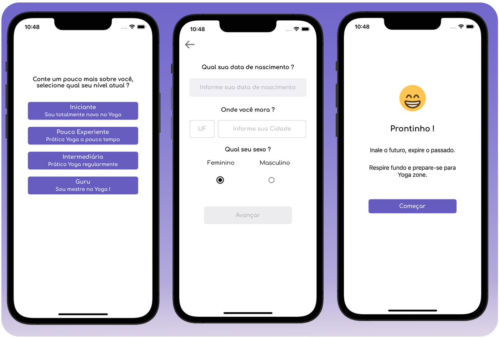
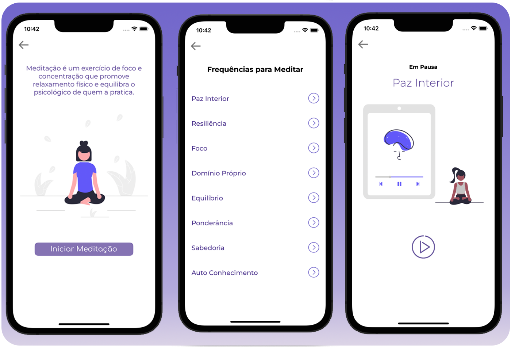
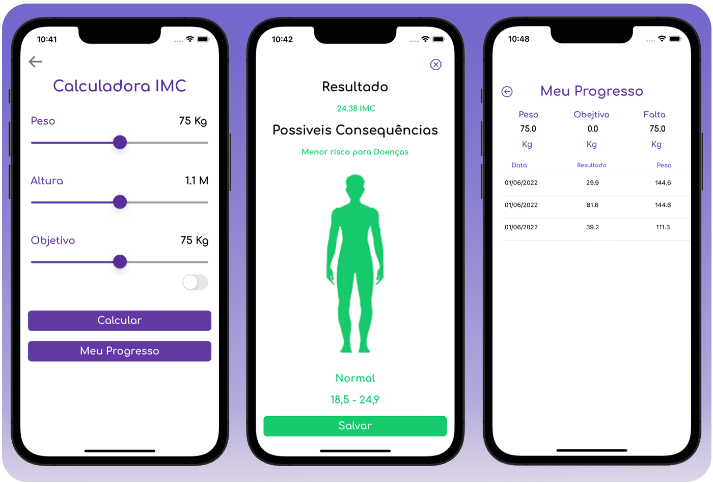
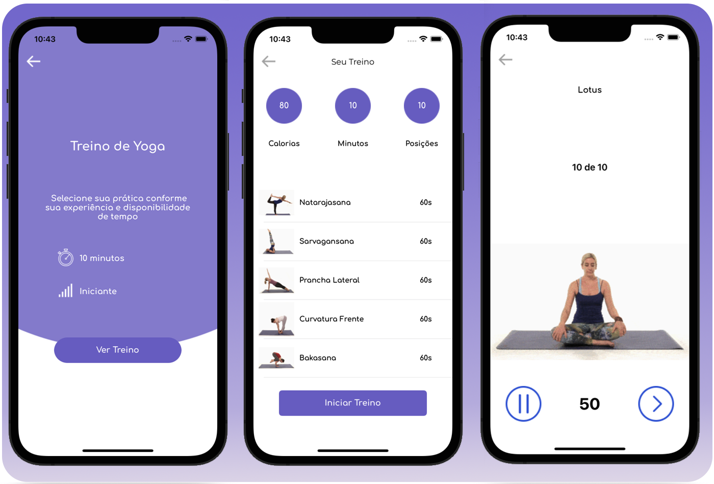
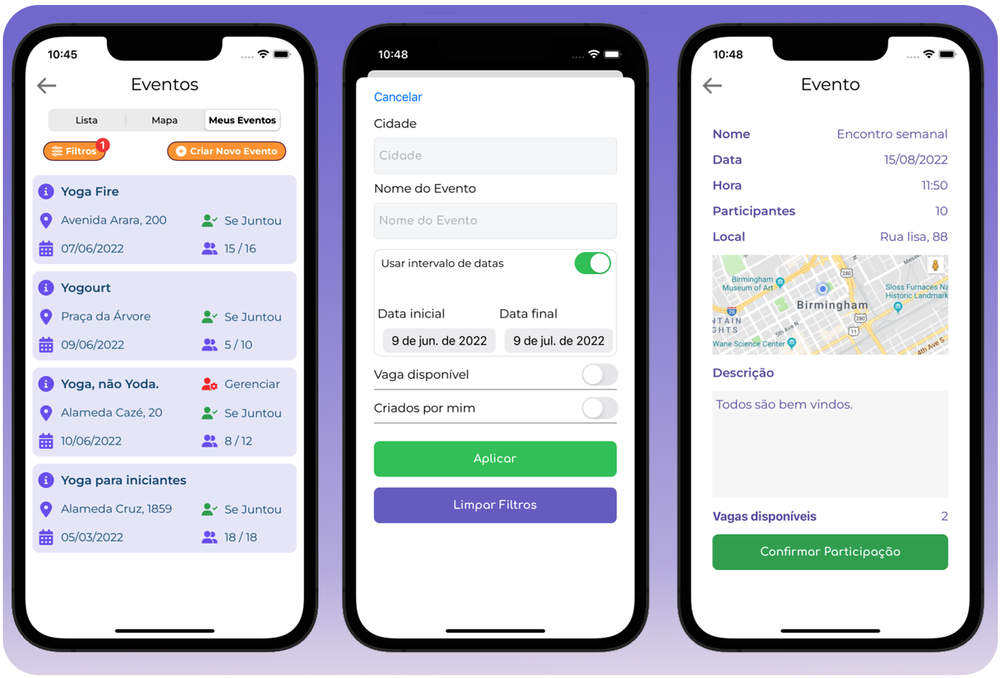

# Yoga Zone

iOS Project with the theme of yoga.

Leia em Português: [Portuguese](README.md)

The App has features aimed at individual use such as a BMI calculator where you can keep an individual record of your progress, sounds for meditation practice, a gallery with yoga poses and videos, yoga training and an events section to interact with users looking for events or creating new ones.

**_Note: Still in development_**

## Prototype

The prototype design created by the group is available to be viewed in Figma: https://www.figma.com/file/P3a74UujkaHTRo4xSQPBEa/App_YogaZone?node-id=0%3A1

## Techonolgies used:

Swift, MVC(Still migrating features to MVVM), MVVM, UIKit with Autolayout, Xib, Storyboard, View Code, Userdefaults, CocoaPods, Firebase, Firestore, integration with REST services.

## Configuration

After cloning the project, install the pods:

```
$ cd YogaZone
$ pod install
$ open YogaZone.xcworkspace
```

Run the build in XCode.

## Screenshots






