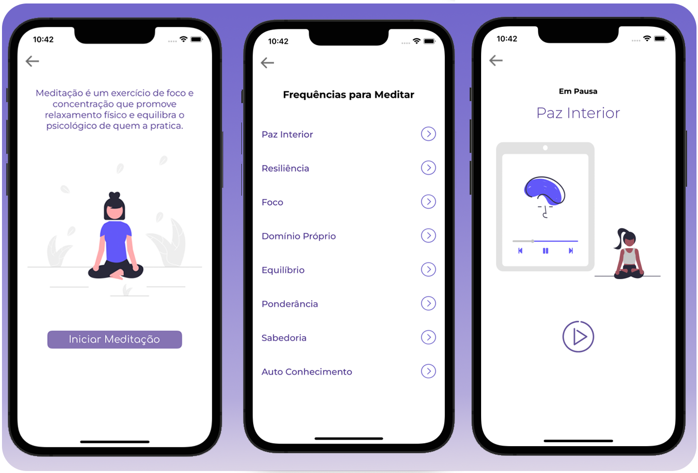
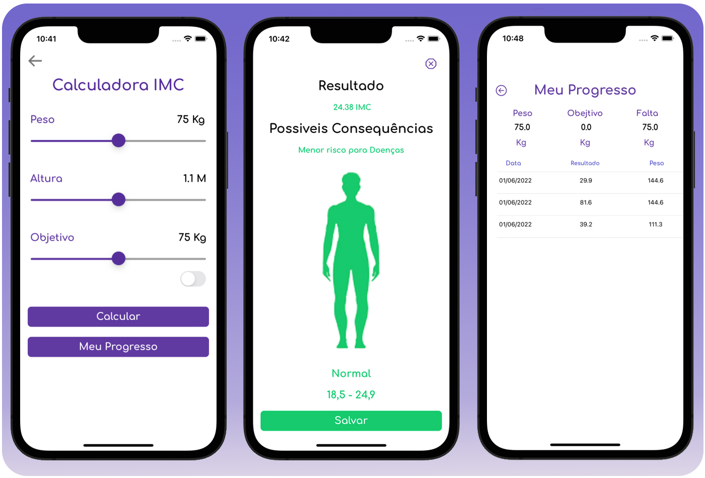
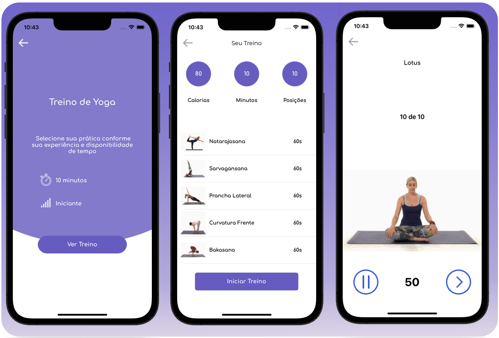
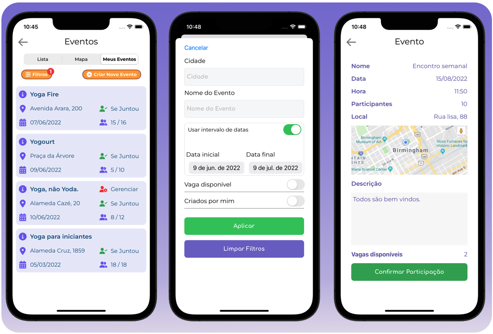

# Yoga Zone

Projeto Integrador com o tema de yoga. 

O App possui funcionalidades voltadas para uso individual como calculadora de IMC, sons para prática de meditação, galeria com poses de yoga e como usa-las, treinos de yoga e uma seção de eventos para encontrar e criar encontros.

**_Obs: Ainda em desenvolvimento_**

## Configuração

Após clonar o projeto, instalar os pods:

```
$ cd YogaZone
$ pod install
$ open YogaZone.xcworkspace
```

Excutar o build no xcode.

## Screenshots





